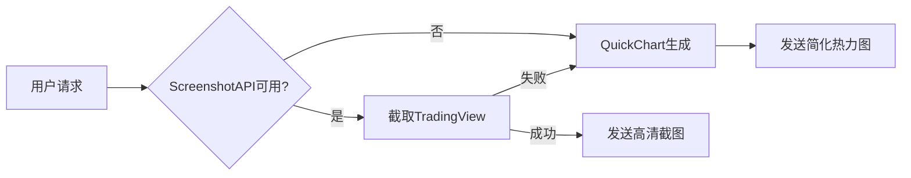

# 🎨 TradingView 热力图功能使用指南

## 功能概述

USIS Brain v4.3 新增**真实 TradingView 热力图截图**功能，通过 ScreenshotAPI 捕获实时市场热力图，失败时自动降级到 QuickChart 生成。

---

## 快速开始

### 1️⃣ 配置 ScreenshotAPI（可选）

在 Replit Secrets 中添加：

```
SCREENSHOT_API_KEY=your_api_key_here
```

**获取 API Key:**
1. 访问 https://screenshotapi.net
2. 注册并获取免费 API Token
3. 粘贴到 Replit Secrets

> ⚠️ **未配置会怎样？** 系统自动使用 QuickChart 降级方案，功能正常但热力图为简化版本。

---

## 使用方法

### Telegram Bot 触发

#### 方法 1: 命令触发
```
/heatmap
```

#### 方法 2: 关键词触发
发送包含以下关键词的消息：
- `热力图`
- `heatmap`

示例：
```
给我看美股热力图
Show me the heatmap
```

---

## 功能特性

### ✅ 多市场支持

| 市场 | 数据集 | TradingView 覆盖范围 |
|------|--------|---------------------|
| US (美国) | SPX500 | 标普500成分股 |
| Europe (欧洲) | DAX | 德国DAX指数 |
| China (中国) | AllCN | 中国全市场 |
| Spain (西班牙) | IBEX35 | IBEX35指数 |
| Germany (德国) | DAX | DAX指数 |
| UK (英国) | UK100 | 富时100指数 |
| France (法国) | CAC40 | CAC40指数 |
| Japan (日本) | AllJP | 日本全市场 |

### ✅ 智能降级



### ✅ 响应信息

**ScreenshotAPI 成功时:**
```
📊 美国 TradingView热力图
数据集: SPX500
来源: ScreenshotAPI截图
耗时: 12.3秒
```

**QuickChart 降级时:**
```
📊 美国 实时热力图
来源: QuickChart (降级)
耗时: 3.5秒
```

---

## 技术细节

### ScreenshotAPI 参数

```javascript
{
  url: 'https://www.tradingview.com/heatmap/stock/?...',
  token: SCREENSHOT_API_KEY,
  output: 'image',
  file_type: 'png',
  wait_for_event: 'load',
  delay: 5000,           // 等待5秒让热力图完全加载
  full_page: false,
  width: 1200,
  height: 800,
  device_scale_factor: 2 // 2倍分辨率 = 高清
}
```

### 超时保护

- API 请求超时: 20秒
- 客户端总超时: 25秒
- 降级触发时间: <1秒

### 错误处理

所有错误记录到 `console.warn`，不会中断用户体验：

```
⚠️  ScreenshotAPI失败: 401 - Unauthorized
📉 降级到QuickChart生成热力图...
✅ QuickChart降级成功 (2345ms)
```

---

## 常见问题

### Q: 为什么不直接用 TradingView 嵌入？
A: TradingView 的热力图需要 JavaScript 动态渲染，无法直接生成静态图片。ScreenshotAPI 通过浏览器截图解决了这个问题。

### Q: QuickChart 和 ScreenshotAPI 有什么区别？
A: 
- **ScreenshotAPI**: 真实 TradingView 界面，完整市场数据
- **QuickChart**: 基于 Finnhub API 的简化版本，数据有限

### Q: 如何判断使用了哪个方案？
A: 查看图片 caption 的 "来源" 字段：
- `来源: ScreenshotAPI截图` = 真实TradingView
- `来源: QuickChart (降级)` = 简化版本

### Q: ScreenshotAPI 免费吗？
A: 有免费额度，具体查看 https://screenshotapi.net/pricing

### Q: 可以自定义颜色和大小吗？
A: 当前版本默认配置为：
- 颜色: 涨跌幅 (change)
- 大小: 市值 (market_cap)

未来版本将支持自定义参数。

---

## 代码集成示例

### 手动调用 generateHeatmap()

```javascript
const result = await generateHeatmap({
  market: 'US',        // 市场
  color: 'change',     // 颜色维度
  size: 'market_cap'   // 大小维度
});

if (result.buffer) {
  // ScreenshotAPI 成功
  await ctx.replyWithPhoto({ source: result.buffer }, { 
    caption: result.caption 
  });
} else if (result.image_url) {
  // QuickChart 降级
  await ctx.replyWithPhoto(result.image_url, { 
    caption: result.caption 
  });
}
```

---

## 更新日志

### v4.3 (2025-11-05)
- ✅ 新增 ScreenshotAPI 集成
- ✅ 实现智能降级机制
- ✅ 添加 `/heatmap` 命令
- ✅ 修复 GET 请求格式（之前错误使用了 POST）
- ✅ 添加市场映射逻辑

---

## 支持

遇到问题？
1. 检查 SCREENSHOT_API_KEY 是否正确配置
2. 查看控制台日志：`⚠️  ScreenshotAPI错误`
3. 验证 API Key 额度是否用完

**系统状态检查:**
```bash
node index.js
# 看到 "⚠️  SCREENSHOT_API_KEY 未配置" = 需要配置
# 没有警告 = 配置正确
```

---

生成时间: 2025-11-05  
USIS Brain 版本: v4.3  
作者: AI Development Team
